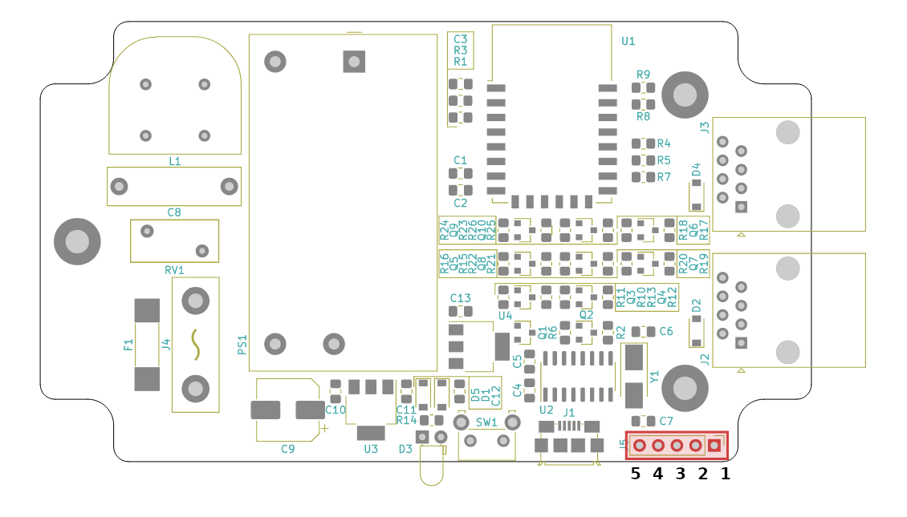

# **ESP8266DevBoard v1.1**

## Programming interface

The Serial UART interface is available at `J5` with the following pinout:

| Board Pin# | Signal | Required |
| ---------- | ------ | -------- |
| 1          | DTR    | YES      |
| 2          | RX     | YES      |
| 3          | TX     | YES      |
| 4          | RTS    | YES      |
| 5          | GND    | YES      |

For programming, all the pins marked as required must be connected.

**Remember to connect RX signal of the board to the RX signal of the programmer (same for TX).**

## Changelog

### **Changelog v1.1** ##
* J2, J3 (China RJ11 connectors) changed with RJ45 (MTJ-881X1)
* new LED and buzzer 12V controll lines added on each RJ45 connector

### **Changelog v1.2** ##
* J5 programming connector added (68001-420HLF)
* U2, Y1, C4, C5, C6, C7, D1, J1 set to DNP

